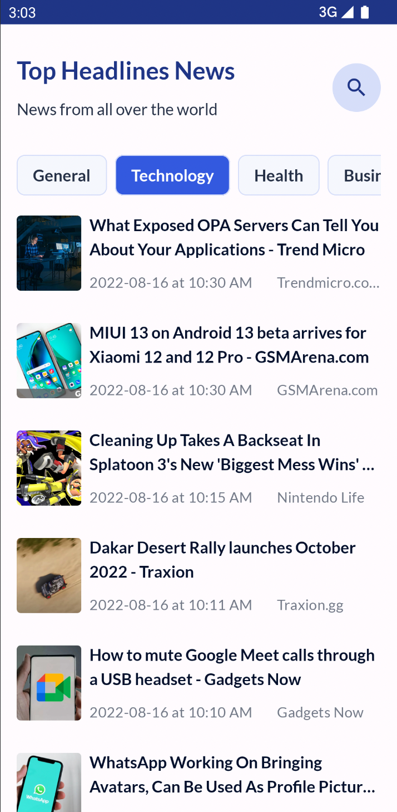
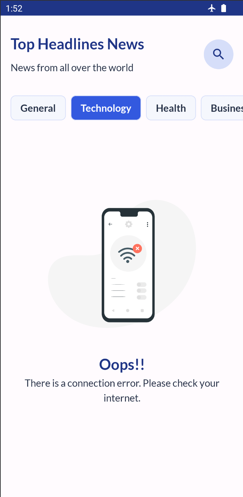
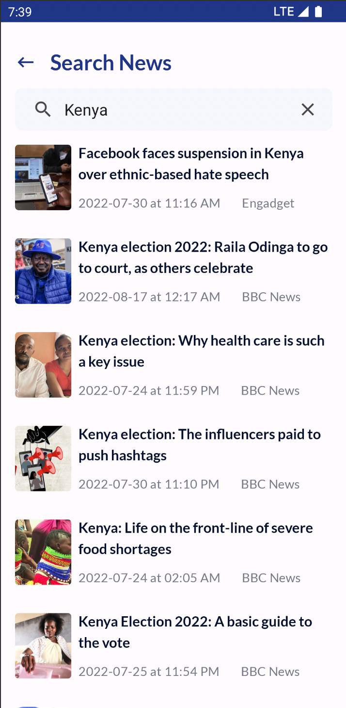

# News App

News App is a simple news app that fetches top headline news from [NewsAPI](https://newsapi.org/)

 
 
 

  
  

# Development Environment

* You will require latest version of Android Studio 3.0 (or newer) to be able to build the app
* Android Studio Bumblebee | 2021.1.1 Patch 2 or Higher
* Language: Kotlin
* Build System: Gradle

# API key 🔑
You'll need to provide API key to fetch the news from the News API Service. Currently the news is fetched from [NewsAPI](https://newsapi.org/)

- Generate an API key (It's only 2 steps!) from [NewsAPI](https://newsapi.org/)
- Create new file named -> `secrets.properties` in our project root folder
- Add the API key as shown below [Make sure to keep the double quotes]:
   `API_KEY = "<INSERT_YOUR_API_KEY>"`
- Build the app
- Enjoyyyyy 🎉

# Architecture
The app uses MVVM (Model View View Model) architecture to have a unidirectional flow of data, separation of concern, testability, and a lot more.

# Tech Stack

- Tech Stack
  - [Kotlin](https://kotlinlang.org/) - First class and official programming language for Android development.
  - [Android Jetpack](https://developer.android.com/jetpack) https://developer.android.com/topic/libraries/data-binding/
    * [Data Binding](https://developer.android.com/topic/libraries/data-binding/) - A support library that allows you to bind UI components in your layouts to data sources in your app using a declarative format rather than programmatically.
    * [LiveData](https://developer.android.com/topic/libraries/data-binding/) - An observable,lifecycle-aware data holder.
    * [Room](https://developer.android.com/topic/libraries/architecture/room) - a persistence library provides an abstraction layer over SQLite.
    * [Lifecycle](https://developer.android.com/topic/libraries/architecture/lifecycle) - perform action when lifecycle state changes.
    * [ViewModel](https://developer.android.com/topic/libraries/architecture/viewmodel) - store and manage UI-related data in a lifecycle conscious way.
     * [Paging 3](https://developer.android.com/topic/libraries/architecture/paging/v3-migration) - Pagination Library
  - [Kotlin coroutines](https://kotlinlang.org/docs/reference/coroutines-overview.html) - Executing code asynchronously.
  - [Retrofit](https://square.github.io/retrofit/) - Type-safe HTTP client for Android and Java and Kotlin by Square, Inc.
  - [Moshi](https://square.github.io/moshi/1.x/moshi/index.html) - A modern JSON library for Android, Java and Kotlin
  - [OkHttp interceptor](https://github.com/square/okhttp/tree/master/okhttp-logging-interceptor) - Logs HTTP requests and responses
  - [Flow](https://kotlinlang.org/docs/reference/coroutines/flow.html) - handle the stream of data asynchronously that executes sequentially.
  - [KOIN](https://insert-koin.io/) - a pragmatic lightweight dependency injection framework.

- Gradle
  * [Gradle Kotlin DSL](https://docs.gradle.org/current/userguide/kotlin_dsl.html) - For reference purposes, here's an [article](https://evanschepsiror.medium.com/migrating-to-kotlin-dsl-4ee0d6d5c977) explaining the migration.
  * Plugins
      - [Ktlint](https://github.com/JLLeitschuh/ktlint-gradle) - creates convenient tasks in your Gradle project that run ktlint checks or do code auto format.
      
- CI/CD
  * Github Actions

